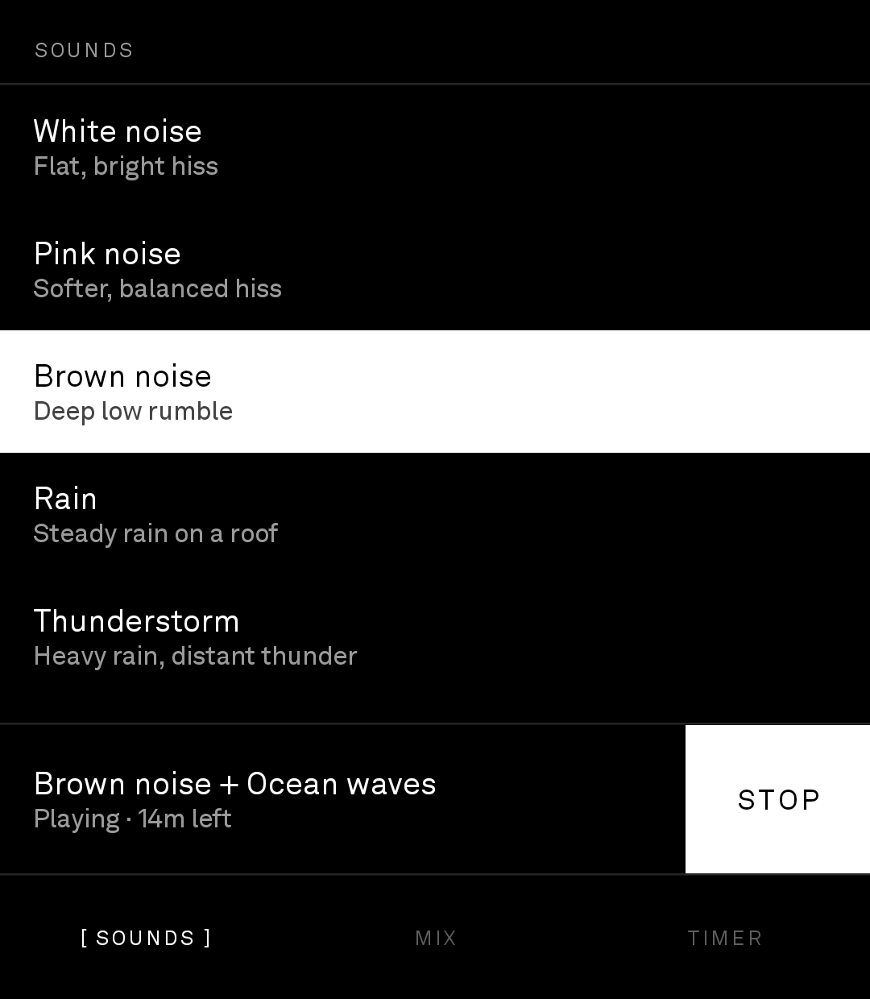
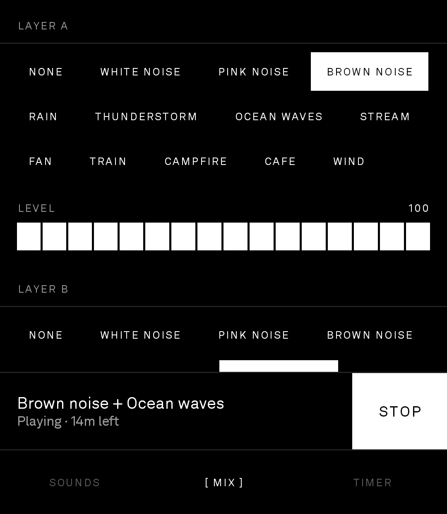
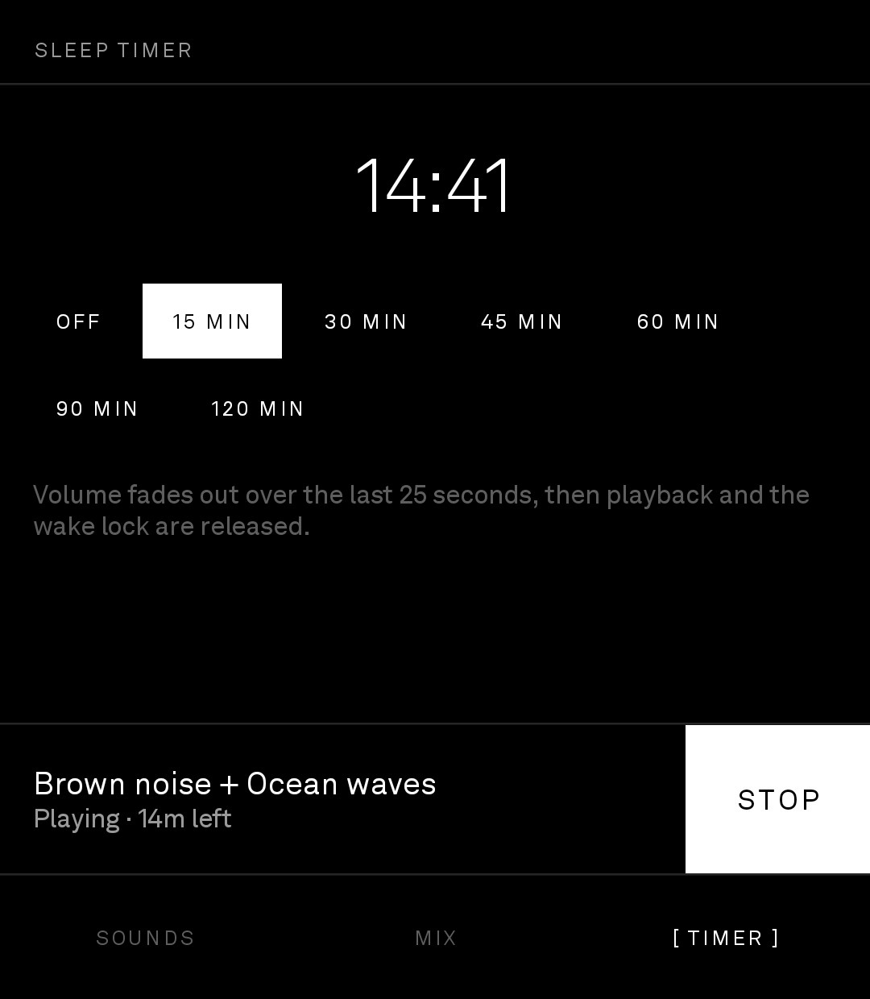

# BrightNoise

White noise and background sound for the **Light Phone III**. Twelve endless sounds,
a two-layer mixer, and a sleep timer, in a black-and-white UI that matches LightOS.

## Install via BrightMarket

<p align="center">
  
</p>

Scan the code above with **BrightMarket** installed to open BrightNoise there and
install or update it directly. Don't have BrightMarket yet? Get it, and browse
every Bright app, at
**[brightmarket.gzl.dev](https://brightmarket.gzl.dev)**.

Repo name **BrightNoise**, launcher label **White Noise**, applicationId
`com.gios.lightnoise`.

**Current release: v1.0.7** (tag `v1.0.7`).

## Screenshots

<table>
  <tr>
    <td align="center">
      <br>
      <sub>Twelve sounds, each with what it is</sub>
    </td>
    <td align="center">
      <br>
      <sub>Two layers, each with its own level</sub>
    </td>
    <td align="center">
      <br>
      <sub>Sleep timer, fading out at the end</sub>
    </td>
  </tr>
</table>

The now-playing bar and the tab row stay put on all three screens. Taken on a Light Phone III.

## Install

Grab the APK from the [latest release](../../releases/latest) and sideload it:

```bash
adb install -r LightNoise-v1.0.<run>.apk
```

Every push to `main` publishes a signed release, so `-r` upgrades in place.

One stable 4096-bit key signs every build (`keystore/lightnoise.jks`, committed on
purpose) and exactly one APK ships per release, which is what Obtainium needs. The
certificate SHA-256 is pinned in `signing-fingerprint.txt` and CI fails on drift —
a changed certificate otherwise surfaces only as `Failure: Invalid` at install time.

## Sounds

All twelve are **synthesised in real time**, not looped audio files. Nothing repeats,
there is no seam to notice at 3 a.m., and the APK carries no audio assets.

| | Sound | How it is made |
|---|---|---|
| 1 | White noise | Uniform noise, rolled off above 14 kHz |
| 2 | Pink noise | Kellet economy filter, −3 dB/oct |
| 3 | Brown noise | Leaky integrator, −6 dB/oct |
| 4 | Rain | Hiss + mid body + ~55 discrete drops/sec, slow gusts |
| 5 | Thunderstorm | Heavier rain, plus a swept low rumble every 20–70 s |
| 6 | Ocean waves | 7–13 s swell driving both a lowpass sweep and foam |
| 7 | Stream | Two noise bands around 620 Hz and 1.65 kHz, plus pitch-drifting gurgles |
| 8 | Fan | Oscillating head sweeping over 7.1 s, mains hum, blade beating |
| 9 | Train | Rail rumble with a rail-joint clack every ~1.5 s |
| 10 | Campfire | Ember bed with woody crackles that arrive in bursts |
| 11 | Cafe | Fourteen quiet talkers of formant-filtered noise, distance-filtered, plus cutlery |
| 12 | Wind | One gust envelope driving amplitude, cutoff and leaf hiss together |

## Using it

Three tabs, with the transport always visible above them.

- **SOUNDS** — tap any sound to start it immediately.
- **MIX** — layer A and layer B with independent levels, plus master volume. Layer B is
  muted while it is set to None.
- **TIMER** — off / 15 / 30 / 45 / 60 / 90 / 120 min. Volume fades over the last 25
  seconds, then playback and the wake lock are released.

The mix and timer choice are saved, so the app reopens on whatever you fell asleep to.
Playback runs in a foreground service with a partial wake lock and survives the screen
going off; there is a Stop action in the notification shade.

## The wheel

Turning the brightness wheel scrolls the sound list and the mixer. Both are longer than the
panel, and this is an app you reach for with the lights off — finding a scroll gesture on a
matte screen in the dark is harder than finding the wheel your thumb is already resting on.
The timer tab fits, so nothing there answers a notch.

It works because Light patched `/system/usr/keylayout/Generic.kl`: a notch of the
`Pixart pat9126ja` sensor arrives as an ordinary key event and nothing above the app
intercepts it. `hw/LightKeys.kt` resolves `WHEEL_CCW` and `WHEEL_CW` by label at runtime and
falls back to the raw scancode gated on the device name, so a paired keyboard's `r` doesn't
scroll. Notches are frame-timed into a glide rather than applied as they land, and the first
notch after a pause waits for a second one to confirm it wasn't a stray brush. Both are
explained at length in
[LightNews](https://github.com/gi-os/LightNews#the-wheel-and-the-camera-button).

So it needs nothing but BrightNoise: the key goes to whichever app has focus, and this one
handles it. No service to enable, no permission to grant, no root. Turns only, though —
pressing the wheel in and the camera button are ignored here.
[BrightControl](https://github.com/gi-os/BrightControl) is the optional app that gives those a
use: hold the wheel in and turn to change brightness, tap it for the flashlight, the camera
button opens the camera, and each of the three is rebindable — tap and hold separately — to any
app on the phone. It also hands brightness, or a synthetic-swipe scroll, to apps that don't
read the wheel themselves. Installing it does not cost you the scrolling here: bare turns are
passed through to `com.gios.*` on purpose, because a notch at a time inside the app is better
than anything a service outside it can imitate.

```bash
# Optional: BrightControl, for brightness, the flashlight and the camera button
adb install -r LightControl-v1.0.x.apk

# The key service. NOTE: this setting is a list, and this command REPLACES it —
# if you also run LightVoice's push-to-talk, colon-join both components instead.
adb shell settings put secure enabled_accessibility_services \
  com.gios.lightcontrol/com.gios.lightcontrol.keys.ControlService
adb shell settings put secure accessibility_enabled 1

# Brightness, and the level readout + opening apps from the service
adb shell appops set com.gios.lightcontrol WRITE_SETTINGS allow
adb shell appops set com.gios.lightcontrol SYSTEM_ALERT_WINDOW allow
```

Latest APK: <https://github.com/gi-os/BrightControl/releases/latest>

## Design notes

- **Plain sideloaded APK, not a LightOS SDK tool.** The `light-sdk` Gradle plugin's
  dependency allowlist has no audio path of its own and its `BLOCKED_IMPORTS` ban
  `android.app.*`, which rules out a foreground service. Same conclusion as BrightPasses
  and BrightTip.
- **Greyscale-only palette.** Selection *inverts* rather than tints — on a matte
  black-and-white panel that is the only state change legible at arm's length in a dark
  room. Akkurat is pulled out of `SystemFonts` so the app matches LightOS chrome.
- **Levels are segmented blocks, not Material sliders.** A slider thumb is a poor
  target on a 3.92" screen and its track is nearly invisible in greyscale.
- **All twelve sounds are level-matched to 0.12 RMS**, so swapping presets changes the
  texture and not the volume. Layer and master gains are squared before they are
  applied, because a linear amplitude slider feels dead until its last quarter.
- **Output runs through a look-ahead limiter, and that is what makes the app loud
  enough.** Normalising generators to 0.12 RMS put playback at −24.6 dBFS, about 10 dB
  under music and podcasts, so the phone had to be at full volume to hear anything.
  These sounds have a crest factor near 7 — the bed sits far below the occasional rain
  drop or spoon clink — so raising the master alone clips transients long before the bed
  gets loud. A 1.7x makeup gain plus limiting lands the default at −15.7 dBFS and full
  master at −14.0, level with mastered music. The look-ahead is not decorative: a plain
  feedforward limiter derived its gain from the sample it was already outputting and let
  peaks through at exactly 1.0, and its peak follower needs to *hold* for the length of
  the delay line or the gain starts recovering before the peak it is guarding against
  arrives.
- **`material-icons-extended` is banned** — on BrightTip it alone was ~30 MB. `abiFilters`
  is arm64 only.
- **The launcher icon is a vector adaptive icon with no PNG buckets.** minSdk is 29, so
  every device this installs on supports adaptive icons. Five chunky bars rather than
  seven thin ones: an adaptive icon only shows its inner 72 of 108 dp, and a 6 dp bar
  lands at about two pixels in a launcher grid.

## Tests

The synthesis layer has no Android imports, so it runs on the JVM:

```bash
./gradlew :app:testDebugUnitTest
```

The tests are less about correctness than about stability: a state-variable filter that
goes unstable ten minutes into a session is a screech at 3 a.m., and a five-second
listen will not catch it. They render 60–120 s of every sound and assert no non-finite
samples, no clipping, no DC drift, an audible-but-not-loud RMS, and less than 12 dB of
spread across the set.

Three of them check character rather than safety, because "it sounds wrong" is otherwise
only findable by ear:

- The fan's envelope must correlate with itself one 7.1 s sweep later and anti-correlate
  half a sweep later. Measuring how far the level *swings* does not work — brown noise
  wanders about as much over a second as the fan sweeps. The test also runs the same
  measure on pink noise and fails if it stops discriminating.
- Campfire must keep under 2 % of its energy above 2.5 kHz, so crackles stay woody
  instead of drifting back toward static.
- Cafe must concentrate over 45 % of its energy in the 300–3400 Hz speech band and beat
  pink noise there by 1.8x, keep under 20 % of its energy below 250 Hz, and have a
  *smoother* envelope than pink noise. The last two encode a fix: an earlier version
  sounded, accurately, demonic. Sharp formants with F1 dipping into the chest register,
  gated deeply on a few loud talkers, is unpitched noise doing vowels — the ear reads it
  as something speaking that should not be able to.
- The limiter has its own three: it must hold a 0.9 ceiling against 2.5-amplitude spikes,
  leave a quiet bed within 2 % of unity, and release fully within a second.

CI runs the whole suite before it builds the APK.

## Contributing

The DSP layer (`audio/Dsp.kt`, `Sounds.kt`, `LoopGenerator.kt`) has no Android imports on purpose, so
it runs and is tested on the plain JVM — that's what `./gradlew :app:testDebugUnitTest` exercises.
Anything that changes a generator's character should come with a test that encodes the specific
complaint, the way the fan, campfire, and cafe tests do — "sounds wrong" is otherwise only
findable by ear, and by the time it's noticed it's 3 a.m. and the sound has been playing for an hour.
Retune loudness by editing the per-generator output gain and re-running the RMS measurement; don't
reach for the master/limiter to fix a quiet sound. A user loop-file feature (decode arbitrary audio
from storage) was built and deliberately removed — don't reintroduce it without asking; every sound
in this app is synthesised, full stop.

## Version history

Every push to `main` publishes a signed release tagged `v1.0.<run number>` (`app/build.gradle.kts`
keeps `versionName "1.0.0"`; CI stamps the real version from the workflow run number). See
[`.github/workflows/build.yml`](.github/workflows/build.yml).

- **v1.0.7** (2026-07-29) — Documented that the wheel needs nothing else installed.
- **v1.0.6** (2026-07-29) — Hardware wheel scrolls the Sounds and Mix tabs.
- **v1.0.5** (2026-07-28) — Added screenshots and the gi-os collection table to the README.
- **v1.0.4** (2026-07-28) — Fixed the cafe sound (formant Q down from 7–11 to ~3, F1 floored at
  430 Hz, 14 quiet talkers instead of two loud ones — the loud pair was what made it sound
  "demonic"); added a look-ahead output limiter plus 1.7x makeup gain, raising default loudness from
  −24.6 dBFS to −15.7 dBFS at the default master; pitched the stream sound down about a third.
- **v1.0.3** (2026-07-28) — Dropped the user loop-file feature, rebuilt the cafe sound from
  scratch, gave the fan an oscillating sweep, added a launcher icon.
- **v1.0.2** (2026-07-28) — Pinned the signing certificate and moved to a 4096-bit signing key.
- **v1.0.1** (2026-07-28) — Initial release: twelve real-time synthesised sounds, two-layer mixer,
  sleep timer.

<!-- bright-footer:begin -->
---

## Bright\*

**It's not Light, it's Bright.**

26 open-source apps for the **Light Phone III** — camera, music, maps, messages,
reading, transit, games. The phone has no app store, so they install by sideload: scan one
code from **[brightmarket.gzl.dev](https://brightmarket.gzl.dev)** and BrightMarket keeps them updated.

[Roll](https://github.com/gi-os/Roll) · [BrightNotebook](https://github.com/gi-os/BrightNotebook) · [BrightControl](https://github.com/gi-os/BrightControl) · [BrightWay](https://github.com/gi-os/BrightWay) · [BrightChat](https://github.com/gi-os/BrightChat) · [browse all 26 →](https://brightmarket.gzl.dev)

The Light Phone does not sponsor or endorse any of these. Built by
[Giovanni Lupo](https://github.com/gi-os) — if this one is useful to you, a ⭐ helps the next
person find it.
<!-- bright-footer:end -->
